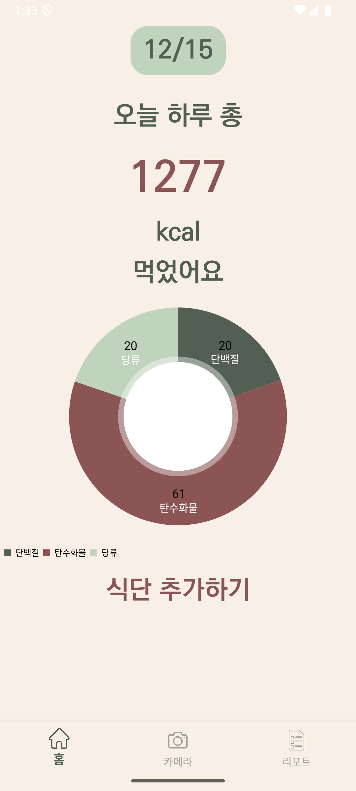
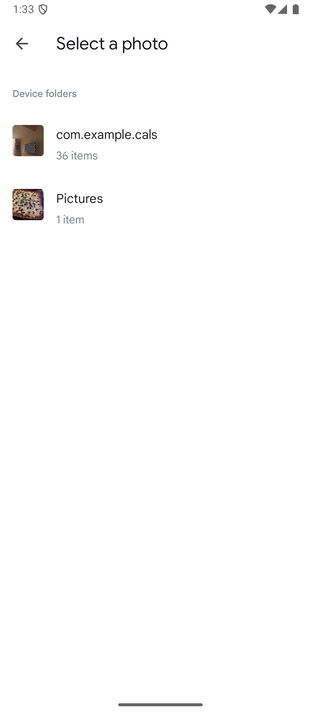
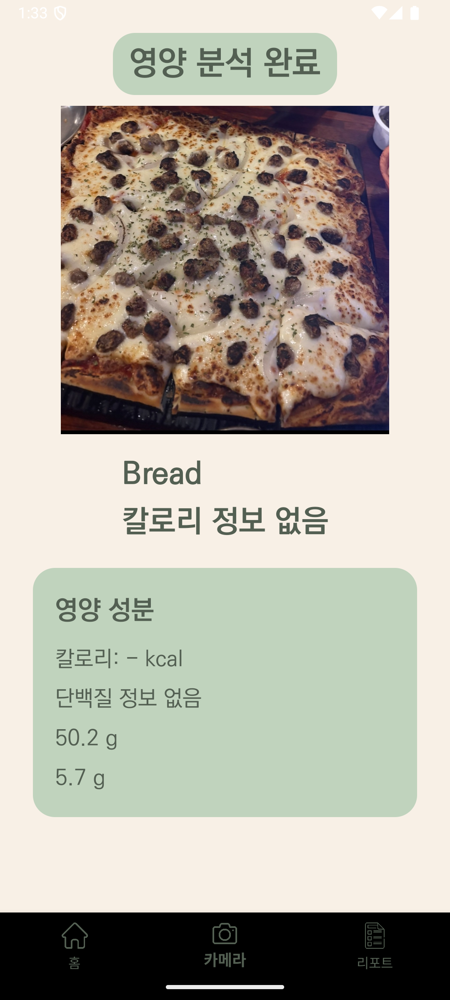
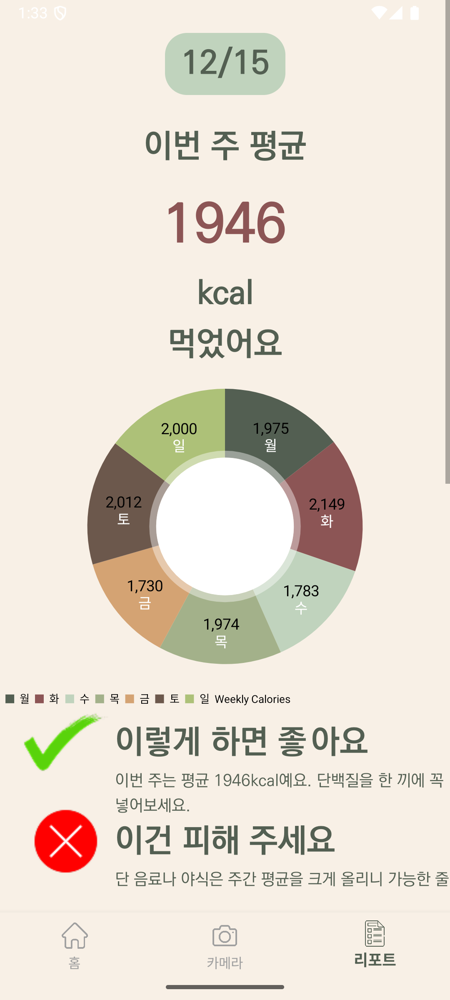
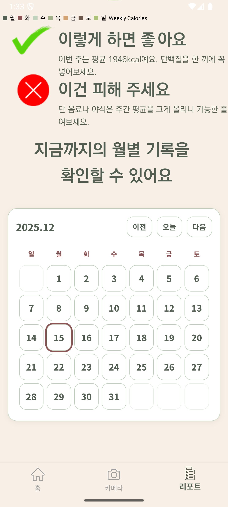

# CALS (Android) 🥗📱

**CALs**는 사용자가 **식단과 칼로리 섭취를 기록/관리**할 수 있는 안드로이드 애플리케이션입니다.  
Kotlin 기반 Android Studio 프로젝트입니다.

---

## 📌 주요 기능

- 🍎 음식 정보 검색
- 🥘 칼로리/영양소 자동 계산
- 📊 차트로 시각화된 일일/주간 섭취량 (예: PieChart, BarChart)
- 🗃 Room 데이터베이스를 활용한 로컬 기록 저장
- 🔎 직관적인 UI

---

## 🧠 기술 스택

| 항목 | 내용 |
|------|------|
| 언어 | Kotlin |
| 플랫폼 | Android |
| UI | Jetpack Compose / XML |
| DB | Room |
| 네트워크 | Retrofit / Gson / Coroutine |
| 차트 | MPAndroidChart |
| 기타 | ViewModel, LiveData/StateFlow |

---
## 📸 앱 스크린샷

### 홈 화면

### 음식 검색

### 음식 촬영

### 주간 리포트

### 주간 리포트 - 2

